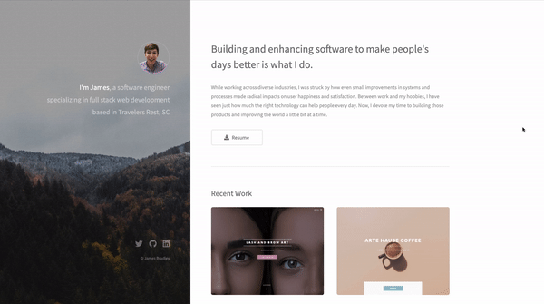

# Portfolio-2022 : <a target="_blank" href="https://jamesbradley.netlify.app">Visit Here</a>

<a target="_blank" href="https://jamesbradley.netlify.app">
<!-- </img> -->

</a>

### Portfolio Site including links to my projects and ways to get in contact with me.

## Tech used: 

My goal was to have something simple and clean. I wanted to avoid the need for users to do a lot of clicking.
The only reason to click is to get my resume, follow a link, or submit a message. All key information can be obtained via scrolling.

## Optimizations

I plan to replace static images with gifs as they are more fun and engaging.

## Lessons Learned:

This project was a great opportunity to hone my CSS. While building, I wasn't entirely happy with the static nature of the buttons and images.
So I spent more time playing with the hover pseudoclass and transitions. I am pleased with the results. The hover transitions on the project thumnbails in particular were fun to watch come into fruition.